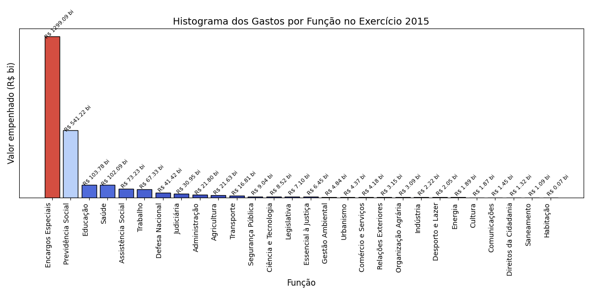

# budget-storytelling-example
An example of how visualization resources may be enhanced for better storytelling in the public budget sector.
The original image below was taken from the pizza chart entitled "Orçamento Geral da União 2015 (Executado) Total = R$ 2,268 trilhão" available at "https://auditoriacidada.org.br/conteudo/explicacao-sobre-o-grafico-do-orcamento-elaborado-pela-auditoria-cidada-da-divida/".
Data from the 2015 public budget was taken from the public resource "Painel do Orçamento Federal", available at https://www1.siop.planejamento.gov.br/QvAJAXZfc/opendoc.htm?document=IAS%2FExecucao_Orcamentaria.qvw&host=QVS%40pqlk04&anonymous=true.

## Original image

## Version using bar chart

## Version using bar chart with log scale in the y-axis

## Version using bar chart with log scale in the y-axis
